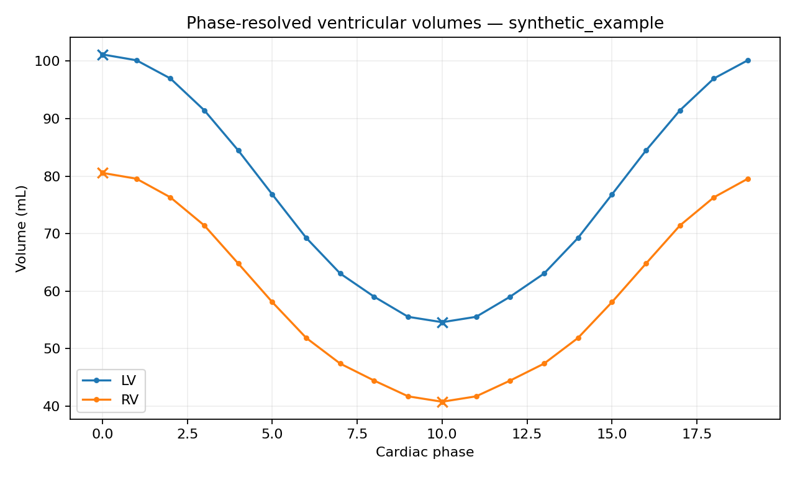

# CMR Volume Analysis

[](https://github.com/alireza-hokmabadi/cmr-volume-analysis/actions/workflows/ci.yml)


**CMR Volume Analysis (`cmrvol`)** is a Python package and command-line tool for reproducible phase-resolved ventricular volume analysis from cine cardiac MRI segmentation label maps.

It is designed for research workflows where a 4D short-axis segmentation is already available and the next task is to convert those labels into transparent, auditable ventricular volume curves and derived functional metrics.

The package deliberately separates **measurement**, **landmark selection**, **derived metrics**, and **quality assurance**. It does not perform segmentation and it does not decide whether a measurement is clinically normal or abnormal.



## Main capabilities

### Phase-resolved LV and RV volumes

For every cardiac phase, `cmrvol` counts the configured ventricular blood-pool labels and converts voxel counts to physical volume using:

```text
voxel volume = abs(det(affine[:3, :3]))
```

Using the full affine determinant makes the physical-volume calculation valid for rotated or sheared voxel bases rather than assuming an axis-aligned image.

### ED and ES detection

For each ventricle:

- end diastole (ED) is selected from the maximum of the volume curve
- end systole (ES) is selected from the minimum of the volume curve
- optional cyclic Savitzky-Golay smoothing can be used for **frame selection only**
- EDV and ESV are always read from the original unsmoothed measurements

This keeps the landmark selection robust while preventing smoothing from silently changing the reported volumes.

### Functional metrics

The package reports:

- ED frame and ES frame
- EDV and ESV
- stroke volume (SV)
- ejection fraction (EF)
- ED-to-ES time when temporal information is available
- peak ejection rate
- peak filling rate
- cardiac output when heart rate is available

### Temporal metadata

Timing can come from:

- a user-supplied frame time
- NIfTI temporal units and fourth-dimension spacing
- heart rate, assuming the cine sequence spans one cardiac cycle

When both frame time and heart rate are supplied, `cmrvol` checks whether they agree with the number of phases and emits a QA finding if they do not.

### Technical QA

The analysis includes deterministic checks for:

- non-4D input
- too few cine phases
- NaN or infinite values
- non-integer or negative labels
- missing LV or RV labels
- zero-volume phases
- disconnected/small components
- abrupt phase-to-phase volume changes
- effectively flat volume curves
- invalid affine voxel volume
- missing qform/sform metadata
- disagreement between supplied heart rate and cine timing

No hard-coded clinical normal ranges are applied.

## Installation

Clone and install:

```bash
git clone https://github.com/alireza-hokmabadi/cmr-volume-analysis.git
cd cmr-volume-analysis
python -m pip install -e .
```

For development:

```bash
python -m pip install -e ".[dev]"
```

## Quick start

Analyze one 4D cine segmentation where LV blood pool is label 1 and RV blood pool is label 2:

```bash
cmrvol analyze cine_segmentation.nii.gz
```

Provide heart rate:

```bash
cmrvol analyze cine_segmentation.nii.gz --heart-rate-bpm 72
```

Provide explicit frame time and save structured outputs:

```bash
cmrvol analyze cine_segmentation.nii.gz \
    --frame-time-ms 40 \
    --json-out subject_001.json \
    --plot-out subject_001.png
```

Use different label IDs:

```bash
cmrvol analyze cine_segmentation.nii.gz --lv-label 3 --rv-label 1
```

## Batch analysis

Create a manifest:

```csv
case_id,segmentation_path,lv_label,rv_label,frame_time_ms,heart_rate_bpm
subject_001,data/subject_001_seg.nii.gz,1,2,40,75
subject_002,data/subject_002_seg.nii.gz,1,2,,70
```

Run:

```bash
cmrvol batch manifest.csv --output-dir analysis_report
```

The output directory contains:

```text
analysis_report/
├── index.html
├── batch_report.json
├── summary.csv
├── phase_volumes.csv
├── findings.jsonl
├── cases/
│   ├── subject_001.json
│   └── subject_002.json
└── plots/
    ├── subject_001.png
    └── subject_002.png
```

`summary.csv` provides case-level functional metrics. `phase_volumes.csv` keeps the complete measured LV/RV curves for downstream analysis.

## Synthetic demo

The repository contains no patient data. Generate a fully synthetic cine-CMR dataset and run the complete analysis pipeline with:

```bash
cmrvol demo demo_output
```

The demo contains examples with:

- a clean cine label map
- a disconnected component
- an abrupt volume-curve change
- a missing RV label

This provides reproducible examples for testing reporting and QA behaviour without distributing clinical data.

## Configurable QA rules

Rules can be stored in JSON:

```json
{
  "integer_tolerance": 0.000001,
  "min_frames": 8,
  "min_component_voxels": 8,
  "min_largest_component_fraction": 0.95,
  "max_relative_phase_jump": 0.35,
  "timing_disagreement_fraction": 0.10,
  "smoothing_window": 5,
  "smoothing_polyorder": 2,
  "use_smoothing_for_landmarks": true,
  "warn_missing_qform_sform": true
}
```

Then use:

```bash
cmrvol batch manifest.csv -o analysis_report --config analysis_rules.json
```

## Python API

```python
from cmr_volume_analysis import AnalysisRules, analyze_cine_segmentation

report = analyze_cine_segmentation(
    "cine_segmentation.nii.gz",
    heart_rate_bpm=72,
    rules=AnalysisRules(max_relative_phase_jump=0.30),
)

for chamber, metrics in report.metrics.items():
    print(
        chamber.upper(),
        f"EDV={metrics.edv_ml:.1f} mL",
        f"ESV={metrics.esv_ml:.1f} mL",
        f"SV={metrics.stroke_volume_ml:.1f} mL",
        f"EF={metrics.ejection_fraction_percent:.1f}%",
    )
```

Array-based analysis is also available for pipelines that already hold segmentations in memory:

```python
from cmr_volume_analysis import analyze_label_array

report = analyze_label_array(
    labels_4d,
    affine,
    case_id="subject_001",
    frame_time_ms=40,
)
```

## Reproducibility

Structured reports preserve:

- software version
- QA rule configuration
- source path
- optional SHA-256 input hash
- image shape and frame count
- physical voxel volume
- temporal parameters
- raw phase-volume curves
- selected ED/ES frames
- derived functional metrics
- machine-readable QA findings

## Development quality

The repository includes:

- numerical unit tests
- synthetic cine-segmentation tests
- NIfTI integration tests
- batch/reporting tests
- Ruff linting
- mypy type checking
- pytest coverage gate
- package-build validation
- CI on Python 3.10, 3.11, 3.12, and 3.13

Run locally:

```bash
pytest --cov=cmr_volume_analysis --cov-report=term-missing
ruff check .
mypy src/cmr_volume_analysis
python -m build
```

## Intended use

This project is intended for **research and software quality assurance**. Derived measurements depend on the supplied segmentation labels and acquisition metadata. The package does not establish clinical correctness and does not replace expert image review or validated clinical analysis software.

No patient or institutional data are included in this repository.

## License

MIT License. See [LICENSE](LICENSE).
